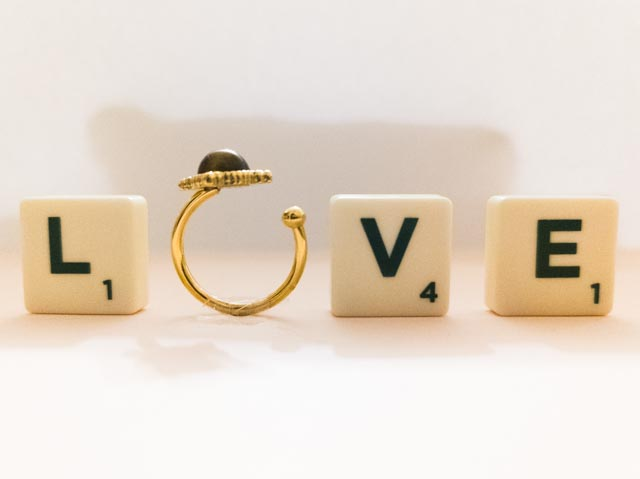
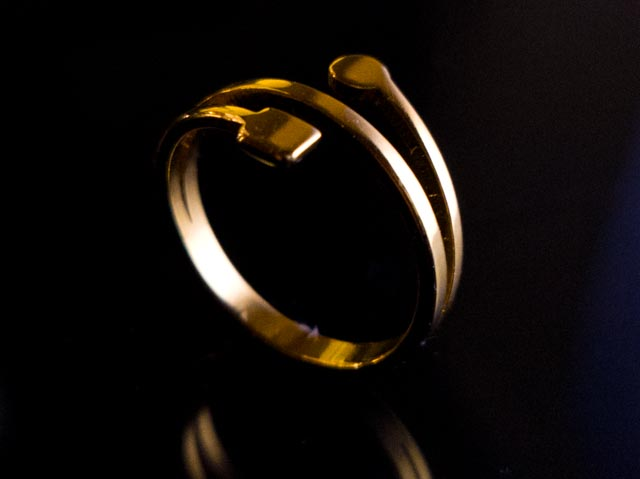
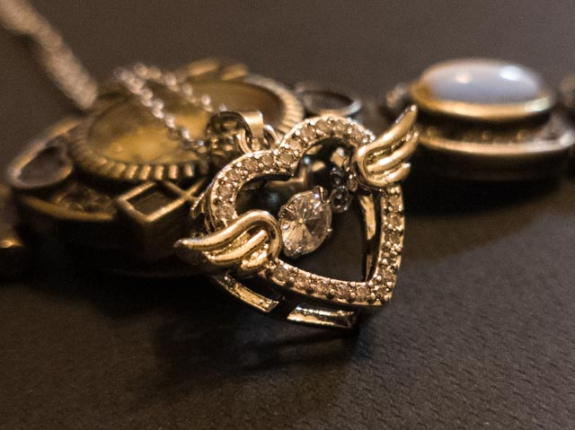
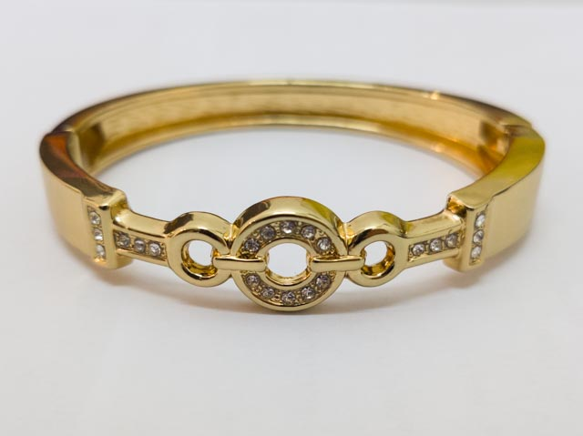

# Projects { data-toc-exclude }

---

## Academic Projects { data-toc-exclude }

### 1. [Level 3 Bachelor Project - Rydberg Physics in Quantum Microwave-Optical Converters: A Qualitative Analysis](Physics%20Note%20Figures/Bachelor_Project__final_BSc_thesis_.pdf) { data-toc-label="Bachelor Project" }

This bachelor's thesis presents a qualitative, graduate-level study on the application of Rydberg systems, utilising highly excited atoms or excitons for microwave-to-optical photon up-conversion. The study includes a direct comparison of Rydberg systems with non-Rydberg converters such as opto-electro-mechanical and magnon-based systems, focusing specifically on conversion efficiency and bandwidth. Finally, it outlines potential technical improvements to enhance the overall efficiency of Rydberg-based converters.

Through this project, I went beyond the core curriculum to apply theoretical and experimental physics at a graduate level. Completing such an extensive body of work within six months developed my project management abilities and required clear, consistent communication with my supervisor, providing valuable experience in an authentic research environment.

### 2. [Level 3 Advanced Lab - Temperature Dependence of Band Gap Energies of Zinc Selenide and Silicon](Physics%20Note%20Figures/Advanced_Lab (1).pdf) { data-toc-label="Advanced Lab" }

Performed visible light spectroscopy to investigate and model the temperature dependence of the band gap energies of zinc selenide and silicon. The experimental results were analysed using the Varshni, Viña and O’Donnell-Chen models, which were then quantitatively compared to assess their relative accuracies. 

This project bridged the gap between theoretical frameworks and practical laboratory work. As the topic was largely outside the taught syllabus, I synthesised knowledge from across my degree to successfully execute the experiment. I gained hands-on experience in assembling optical table setups, operating electronics like silicon photodiodes and processing experimental data. Additionally, I took the lead in guiding and mentoring a peer who was less familiar with the laboratory environment.

### 3. [Level 2 Research-Led Investigation in Astronomy - The Role of Gravitational Perturbations in Determining Jupiter’s Mass: A Comparative Study of Io and Callisto](Physics%20Note%20Figures/Mass_of_Jupiter_V6.pdf) { data-toc-label="RLI" }

Investigated the impact of solar perturbations, mutual satellite interactions and Jupiter’s oblateness on estimating Jupiter’s mass using Graphical Astronomy and Image Analysis Tool (GAIA) in a Linux environment. 

I gained practical experience in analysing astronomical data using specialised software tools within a Linux environment. Through this project, I became proficient in operating telescopes and processing astronomical imaging, including multi-image stacking techniques.

### 4. Level 1 Bridge Project { data-toc-label="Bridge Project" }

Collaborated with a team of three physicists to investigate rolling body dynamics down an incline and projectile motion through systematic experimentation using the scientific method.

This introductory laboratory project taught me to work effectively within a professional research environment and to collaborate efficiently with peers while rigorously following the scientific method.

---

## Personal Hobby Projects { data-toc-exclude }

### 1. Jewelry photo and video editing { data-toc-label="Jewelry photo/video editing" }

- **Commercial Photography and Editing:** Captured RAW photos on mobile and processed them using Adobe Lightroom for promotional campaigns for Kiyowoski. A selection of the final work is featured below:

 

  
  
  
  

 

- **Video Editing and Post-Production:** Edited an introductory promotional video for Kiyowoski using DaVinci Resolve. The final work in MP4 is featured [here](https://youtu.be/O6BrXowpZDQ){ target="_blank" }.